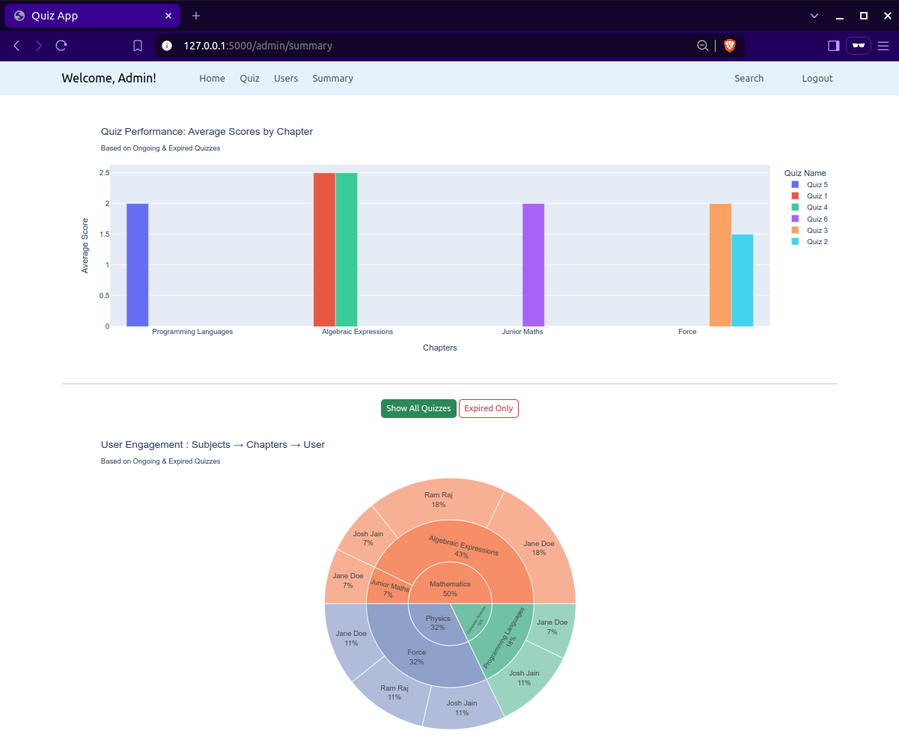
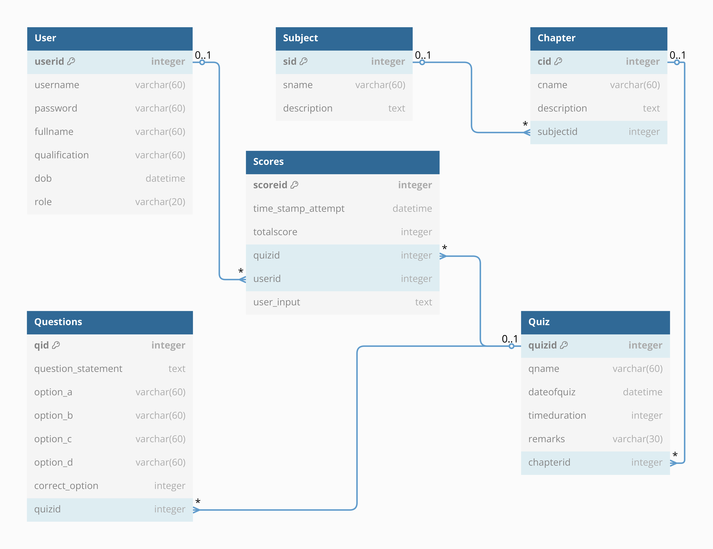

# Quiz-Master-App-V1

## Overview

This is a Flask-based Quiz Application that allows users to take quizzes, track their performance, and provides an admin panel for managing quizzes and analyzing user performance.



## Features

- **User Roles**
  - Admin : Create/manage subjects, chapters, quizzes, and questions
  - Users : Attempt quizzes, view scores/history

- **Quiz Management**
  - Time-limited quizzes with multiple questions
  - Automatic scoring system
  - Quiz attempt history tracking

- **Subject Hierarchy**
  - Subjects → Chapters → Quizzes → Questions

- **Search Functionality**
  - Unified search across users, subjects, chapters and quizzes
  
- **Analytics & Charts**
  - User performance analytics
  - Quiz statistics and participation metrics

## Installation & Setup

### 1.1 Clone the Repository

```bash
git clone https://github.com/21f1006877/Quiz-Master-App-V1.git
cd Quiz-Master-App-V1
```

### 1.2 Alternative : ZIP Extraction

```python
# extract.py
from zipfile import ZipFile

with ZipFile('Quiz-Master-App-V1-main.zip', 'r') as zip:
    zip.extractall('Quiz-Master-App-V1')
print("Extracted to 'Quiz-Master-App-V1' folder")
```

### 2. Create a Virtual Environment

#### Option 1 : Using Virtualenv / Python `venv`

```bash
# Prerequisites : Python 3.10.16

python -m venv env
source env/bin/activate  # On macOS/Linux
pip install -r requirements.txt  # install dependencies
```

#### Option 2 : Using `conda` and `YAML` file

```bash
# Remove existing environment if present
conda env remove -n quizapp  # Skip if its a fresh setup

# Create new environment
conda env create -f environment.yml
conda activate quizapp
```

### 3. File Integrity Verification

Published Checksum : `f703c236c9bbfb36ec9c4baee00bab79`

Generate checksum to verify project integrity :

```bash
python checksum.py  # Generates SHA256 hash
```

### 4. Handling Checksum Discrepancies (*only if encountered*)

If checksum mismatches due to auto-generated files like `__pycache__` :

1. Stop the running Flask app (`Ctrl + C`)

2. Clean untracked files :

    ```bash
    git clean -fdX  # Removes untracked files
    ```

3. Restore original state :

    ```bash
    git restore .  # Restores all tracked modified files.
    ```

    **Important :** `git restore .` is irreversible - any uncommitted modifications will be permanently lost!

### 5. Git Notes (Optional)

[Git Notes](https://git-scm.com/docs/git-notes) added as an additional source of information. To view them :

```bash
git fetch origin "refs/notes/*:refs/notes/*"
git log --notes=commits  # Shows notes with commit history
```

### 6. Run the Flask App

```sh
python run.py
```

The application will be available at `http://localhost:5000/`

## Tech Stack

- **Backend** : Flask, Flask-SQLAlchemy
- **Frontend** : HTML, Bootstrap v5.3, CSS, Jinja2, JavaScript
- **Database** : SQLite
- **Visualization** : Plotly

## Database Schema & ER Diagram

The database follows the relational model with multiple tables linked via foreign keys. Below is the ER Diagram:



## Flask Application Structure

```bash
Quiz-Master-App-V1
├── .env
├── .gitignore
├── LICENSE
├── README.md
├── checksum.py
├── environment.yml
│
├── instance
│   └── quizapp.db
│
├── quizapp
│   ├── __init__.py
│   ├── db_seed.py
│   ├── models.py
│   ├── routes.py
│   ├── static
│   │   └── images
│   │       └── # directory stores images
│   │
│   ├── templates
│   │   ├── admin
│   │   │   └── # directory stores Jinja2 templates of Admin routes
│   │   │ 
│   │   ├── base_main.html
│   │   ├── login.html
│   │   ├── registration.html
│   │   │ 
│   │   └── users
│   │       └── # directory stores Jinja2 templates of User routes
│   │
│   └── utils.py
├── requirements.txt
└── run.py
```

## Final Project Submission

Create ZIP file for submission :

```bash
# From inside Quiz-Master-App-V1 directory aka root directory :
cd ..
mv Quiz-Master-App-V1 quiz_master_21f1006877
zip -r quiz_master_21f1006877.zip quiz_master_21f1006877/
```

## License

The license can be found in the [LICENSE](LICENSE) file.